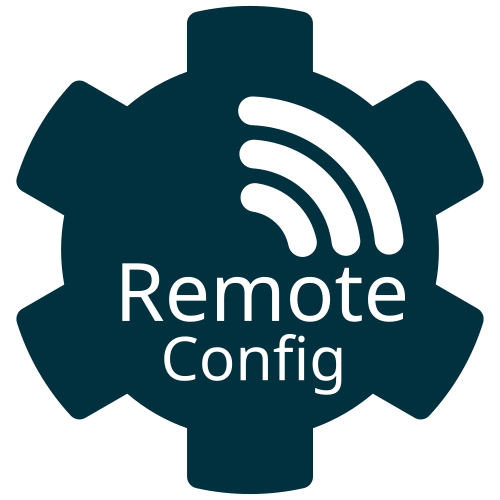

{ width=200 height=200 }


# Remote Config Generator

## Overview

The **Remote Config Generator** is a web application that allows authenticated users to generate configuration files. This users can select different **generators** (such as Linphone) and configure settings such as username, password, domain, transport protocol, and more. The configuration is then stored and made available for download via a QR code or a direct URL.

## Why

A friend of mine needed a phone line for his business, which I was able to provide. We chose Linphone as the softphone client. However, despite providing him with detailed instructions and screenshots for setting up his account, he was unable to establish a connection. Linphone offered a URL for remote provisioning, which led to the development of this application. Instead of being dedicated solely to Linphone, it was designed to be extensible, supporting multiple types of configurations.

## Features

- **Generator Selection**: Choose from available generators (e.g., Linphone).
- **Dynamic Form**: After selecting a generator, the relevant fields are dynamically loaded for configuration.
- **Configuration Generation**: Once the form is filled out, the app generates the configuration based on the input.
- **Storage**: The generated configuration is stored temporarily in Redis.
- **Download Options**: After submission, users receive a **QR code** or a **URL** to download the generated configuration file.

## Technologies Used

- **Node.js**: Backend for handling form submissions and generating configurations.
- **Express.js**: Framework for routing and handling HTTP requests.
- **Redis**: Temporary storage for generated configurations.
- **Docker**: Containerization for easy deployment.
- **Awilix**: Dependency Injection for clean and manageable code.
- **Nunjucks**: Templating engine for rendering dynamic web pages.
- **GitHub Actions**: Continuous integration and deployment (CI/CD) to build and push Docker images to Docker Hub.

## 🚀 Setup and Running Locally

### **Prerequisites**
Before running the project locally, ensure you have the following installed:  
- **[Node.js](https://nodejs.org/)** (LTS recommended)  
- **[npm](https://www.npmjs.com/)** or **[yarn](https://yarnpkg.com/)**
- **[Docker](https://www.docker.com/)** (if using containerized services)

---

### **1 Clone the Repository**
```sh
git clone https://github.com/your-username/your-project.git
cd your-project
```

---

### **2 Install Dependencies**
Using **npm**:
```sh
npm install
```
Using **yarn**:
```sh
yarn install
```

---

### **3  Set Up Environment Variables**
Copy the example environment file and update values as needed:
```sh
cp .env.example .env
```
Edit `.env` with the correct values for your setup.

---

### **4 Start the Development Server**
Using **npm**:
```sh
npm run dev
```
Using **yarn**:
```sh
yarn dev
```
By default, the server runs on **http://localhost:3000/** (or as specified in `.env`).

---

### **5 (Optional) Run with Docker**
To run the project inside a Docker container:
```sh
docker compose up --build
```
This will start the application along with any required services.

---

### **6 Linting & Formatting**
Check for linting errors:
```sh
npm run lint
```
Fix formatting issues:
```sh
npm run format
```

---

### **7 Building for Production**
To create a production-ready build:
```sh
npm run build
```
Then start the production server:
```sh
npm run start
```

---

🚀 You’re all set! Happy coding! 🎉
